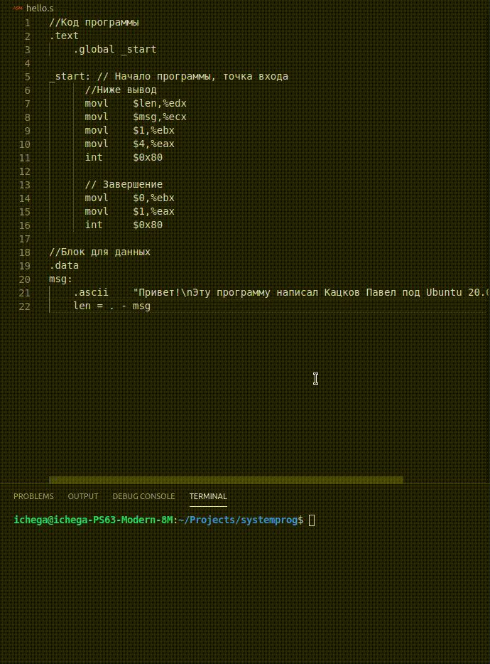

# Программа на GNU Assembler (GAS) под Linux

# Описание

Исходный файл программы - `hello.s`

Программа тестировалась под Ubuntu 20.04

Автор: Кацков Павел

# Комментарии к коду программы

GAS использует синтаксис AT&T который отличается от Intel (включая TASM)

Программа делится на 2 блока: text и data. 

`text` - блок для кода программы.

`data` - блок для данных

`.global` - позволяет сделать "идентификатор" видимым для линковщика `ld`. А также позволяет экспортировать идентификатор в другие модули. В данном случае позволяет линковщику увидеть точку старта - `_start`.

GAS ищет метку _start как точку входа в программу по умолчанию.

`.ascii` тип данных позволяет описать массив строковых символов (без нулевого символа в конце, для этого есть тип `asciiz`), ну или просто строку

`msg` - выводимое сообщение

`len` - длинна выводимого сообщения

`movl    $len,%edx` - поместить длинну сообщения в регистр  edx

`movl    $msg,%ecx` - поместить адрес начала сообщения в ecx

`movl    $1,%ebx` - указать, чтобы системный вывод выводил в stdout (в моем случае - консоль)

`movl    $4,%eax` - укажем что нужно вызвать системный вызов "записать в поток с номер ebx"

`int     $0x80` - вызов функции ядра (вывод на экран)

`movl    $0,%ebx` - укажем что код выхода программы будет 0 (успешное выполнение)

`movl    $1,%eax` - вызов функции ядра с номер 1 - выход из программы

`int     $0x80` - вызов системной функции, завершение программы

# Сборка / Запуск

GAS - часть комплекта утилит GCC (GNU C Compiler)

1. Сборка:  `gcc -c hello.s`
2. Линковка: `ld hello.o`
3. Запуск: `./a.out`

# Демо

